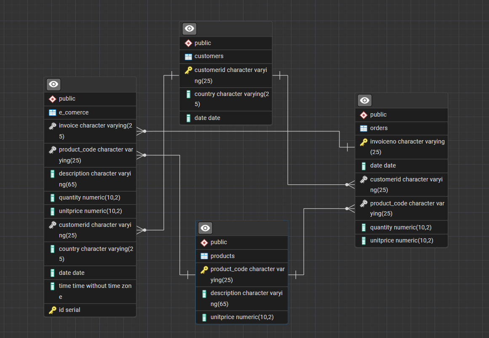

# 🛒 E-Commerce Sales Analysis# 🛒 E-Commerce Sales Analysis


**A beginner-friendly SQL project demonstrating database design, data normalization, and business intelligence using real e-commerce data.**# e_comerce_analysis – Database & SQL Analytics


Perfect for portfolios, interviews, and learning advanced SQL with CTEs!


---A comprehensive SQL-based e-commerce analytics project demonstrating **database design, data normalization, and business intelligence** using real-world transaction data.## Overview


## 📋 Table of Contents


- [Overview](#overview)---This project demonstrates the process of **cleaning, normalizing, and analyzing e-commerce sales data** using SQL. It starts from a raw table (`e_comerce`), transforms and splits columns, normalizes the schema into analytical tables (`customers`, `products`, `orders`), and finally provides a set of advanced SQL queries to extract business insights.

- [Key Features](#key-features)

- [Database Schema](#database-schema)

- [Project Structure](#project-structure)

- [SQL Query Catalog](#sql-query-catalog)## 📋 Table of Contents---

- [Business Insights](#business-insights)

- [Technologies Used](#technologies-used)

- [Getting Started](#getting-started)

- [SQL Skills Demonstrated](#sql-skills-demonstrated)- [Overview](#overview)## Table of Contents

- [Author](#author)

- [License](#license)- [Key Features](#key-features)


---- [Database Schema](#database-schema)- [Schema Design & Normalization](#schema-design--normalization)


## 🎯 Overview- [Project Structure](#project-structure)  - [Original Table Creation](#original-table-creation)


This project showcases a complete e-commerce analytics pipeline:- [SQL Queries](#sql-queries)  - [Cleaning & Transformation](#cleaning--transformation)


1. **📥 Data Cleaning** - Transform raw transaction data into clean format- [Business Insights](#business-insights)  - [Entity Identification & Normalization](#entity-identification--normalization)

2. **🗄️ Database Design** - Normalize schema into 3NF (Third Normal Form)

3. **📊 Business Intelligence** - Extract insights with 20 beginner-friendly SQL queries- [Technologies Used](#technologies-used)  - [Data Insertion](#data-insertion)


**Why This Project?**- [Getting Started](#getting-started)  - [Foreign Key Constraints](#foreign-key-constraints)

- ✅ **Interview-Ready**: All queries use CTEs and answer real business questions

- ✅ **Beginner-Friendly**: Simple logic, clear comments, easy to understand- [Key Learnings](#key-learnings)- [SQL Analytics](#sql-analytics)

- ✅ **Portfolio-Perfect**: Professional structure and documentation

- ✅ **Real-World Data**: Based on actual e-commerce transaction patterns- [Author](#author)  - [High-Level Business Metrics](#high-level-business-metrics)


---- [License](#license)  - [Customer Behavior Analysis](#customer-behavior-analysis)


## ⭐ Key Features  - [Revenue & Product Analysis](#revenue--product-analysis)


### 🗄️ Database Design---  - [Churn & Cohort Analysis](#churn--cohort-analysis)

- **Normalized Schema**: 3 tables (customers, products, orders) following 3NF

- **Data Integrity**: Foreign keys ensure valid relationships  - [Advanced SQL Techniques](#advanced-sql-techniques)

- **Clean Architecture**: Separated concerns, no redundancy

## 🎯 Overview- [Usage](#usage)

### 📊 SQL Analysis (20 Queries)

- **All queries use CTEs** (Common Table Expressions)- [Notes](#notes)

- **Customer Analytics**: Segmentation, retention, lifetime value

- **Revenue Analysis**: Trends, top products, seasonal patternsThis project demonstrates the complete lifecycle of an e-commerce data analytics pipeline:

- **Product Insights**: Performance, affinity, best sellers

- **Simple but Powerful**: Easy to understand, impressive results---


### 📝 Code Quality1. **Data Cleaning**: Transforming raw transaction data

- **Clear Business Questions**: Every query solves a real problem

- **Well-Commented**: Explains the "why" behind each step2. **Database Normalization**: Designing a 3NF relational schema## Schema Design & Normalization

- **Beginner-Friendly**: Avoids over-complicated SQL

- **Interview Tips**: Guidance on explaining queries3. **Business Intelligence**: Extracting actionable insights with SQL


---### Original Table Creation


## 🗄️ Database Schema**Perfect for showcasing:**


### Raw Data Table- Database design & normalization skills```sql

```sql

e_comerce (- Advanced SQL techniques (CTEs, window functions, joins)CREATE TABLE e_comerce (

    id SERIAL PRIMARY KEY,

    invoice VARCHAR(25),- Business analysis & metrics calculation    InvoiceNo   VARCHAR(25),

    product_code VARCHAR(25),

    description VARCHAR(65),- Data-driven decision making    StockCode   VARCHAR(25), -- fk

    quantity DECIMAL(10,2),

    date DATE,    Description VARCHAR(65),

    time TIME,

    unitprice DECIMAL(10,2),---    Quantity    DECIMAL(10,2),

    customerid VARCHAR(25),

    country VARCHAR(25)    InvoiceDate TIMESTAMP,

)

```## ⭐ Key Features    UnitPrice   DECIMAL(10,2),


### Normalized Tables (3NF)    CustomerID  VARCHAR(25), -- fk


**Customers**### Database Design    Country     VARCHAR(25)

- CustomerID (Primary Key)

- Country- ✅ **Normalized Schema**: Separated into customers, products, and orders tables);

- date (first purchase date)

- ✅ **Data Integrity**: Foreign key constraints ensure referential integrity

**Products**

- product_code (Primary Key)- ✅ **Clean Architecture**: Follows 3NF (Third Normal Form) principlesALTER TABLE e_comerce ADD COLUMN id SERIAL PRIMARY KEY;

- Description

- UnitPrice```


**Orders**### SQL Analysis

- InvoiceNo (Primary Key)

- date- 📊 **12 Business Intelligence Queries** with CTEs### Cleaning & Transformation

- CustomerID (Foreign Key → customers)

- product_code (Foreign Key → products)- 📈 **Customer Segmentation**: VIP, Regular, and Occasional customers

- Quantity

- UnitPrice- 💰 **Revenue Analytics**: Trends, top products, best customers- **Splitting Date and Time:**


---- 🔄 **Cohort Analysis**: Customer retention and churn patterns


## 📁 Project Structure- 📉 **Growth Metrics**: Month-over-month revenue tracking```sql


```ALTER TABLE e_comerce ADD COLUMN date_only DATE, ADD COLUMN time_only TIME;

e-commerce-analysis/

│### Code QualityUPDATE e_comerce

├── sql/

│   ├── 01_schema_setup.sql          # Database setup + data cleaning- 🎯 **Beginner-Friendly**: Every query answers a clear business questionSET date_only = CAST(InvoiceDate AS DATE),

│   └── 02_business_analysis.sql     # 20 business intelligence queries

│- 💡 **Interview-Ready**: Includes tips for explaining queries    time_only = CAST(InvoiceDate AS TIME);

├── docs/

│   ├── database_schema.png          # ERD diagram- 📝 **Well-Documented**: Comments explain the "why" behind each queryALTER TABLE e_comerce DROP COLUMN InvoiceDate;

│   └── TABLES.pgerd                 # pgAdmin ERD file

│- 🧹 **Clean Code**: Uses CTEs for readability```

├── data/

│   └── (place your CSV data here)   # Data folder

│

├── README.md                        # This file---- **Renaming Columns for Clarity:**

├── START_HERE.md                    # Quick start guide

├── LICENSE                          # MIT License

└── .gitignore                       # Git ignore rules

```## 🗄️ Database Schema```sql


---ALTER TABLE e_comerce RENAME COLUMN InvoiceNo TO invoice;


## 🔍 SQL Query Catalog### Original Raw TableALTER TABLE e_comerce RENAME COLUMN StockCode TO product_code;


### 📋 Schema Setup (`01_schema_setup.sql`)```sqlALTER TABLE e_comerce RENAME COLUMN date_only TO date;


1. **Create Raw Table** - e_comerce table with all fieldse_comerce (ALTER TABLE e_comerce RENAME COLUMN time_only TO time;

2. **Clean Data** - Split datetime, rename columns

3. **Normalize Schema** - Create customers, products, orders tables    id SERIAL PRIMARY KEY,```

4. **Insert Data** - Load with ON CONFLICT for deduplication

5. **Add Foreign Keys** - Ensure referential integrity    invoice VARCHAR(25),

6. **Data Quality Checks** - 5 validation queries

    product_code VARCHAR(25),### Entity Identification & Normalization

### 📊 Business Analysis (`02_business_analysis.sql`) - 20 Queries

    description VARCHAR(65),

| # | Query Name | Business Question | SQL Techniques |

|---|------------|------------------|----------------|    quantity DECIMAL(10,2),- **Customers**

| **Basic Metrics** |||

| 1 | Business Overview | What are our key metrics? | CTEs, COUNT DISTINCT, aggregations |    date DATE,

| 2 | Customer Activity | How many orders per customer? | GROUP BY, CASE WHEN |

| 3 | High-Value Customers | Who spends the most? | ORDER BY, LIMIT |    time TIME,```sql

| 4 | New vs Returning | Are we retaining customers? | MIN, CASE, date comparison |

| 5 | Top Orders | Which orders made the most? | SUM, GROUP BY |    unitprice DECIMAL(10,2),CREATE TABLE customers(

| 6 | Customer Lifetime Value | Who are our best customers? | Aggregations per customer |

| **Trends & Patterns** |||    customerid VARCHAR(25),    CustomerID  VARCHAR(25) PRIMARY KEY,

| 7 | Monthly Revenue Trends | How is revenue changing? | LAG window function |

| 8 | Best Selling Products | What's #1 each month? | RANK, PARTITION BY |    country VARCHAR(25)    Country     VARCHAR(25),

| 9 | Churned Customers | Who hasn't ordered in 90 days? | DATE arithmetic, intervals |

| 10 | Product Rankings | How do products rank monthly? | RANK, window functions |)    date        DATE

| 11 | Cumulative Revenue | What's our running total? | SUM OVER (ORDER BY) |

| 12 | Cohort Analysis | Which cohort is valuable? | DATE_TRUNC, cohorts |```);

| **Advanced Analytics** |||

| 13 | Purchase Frequency | How often do customers buy? | Frequency bucketing, CTEs |```

| 14 | Product Performance | High volume vs high value? | Simple categorization |

| 15 | Customer Retention | Do customers come back? | Repeat purchase tracking |### Normalized Tables

| 16 | Day of Week Patterns | What day do people shop? | EXTRACT(DOW) |

| 17 | Products Bought Together | What sells together? | Self-join, market basket |- **Products**

| 18 | Customer Segments | Who are VIP customers? | Simple RFM segmentation |

| 19 | Seasonal Analysis | Best sales season? | EXTRACT(QUARTER) |**Customers Table**

| 20 | Order Size Distribution | Small vs large orders? | Bucketing, distribution |

```sql```sql

---

customers (CREATE TABLE products(

## 💡 Business Insights

    CustomerID VARCHAR(25) PRIMARY KEY,    product_code VARCHAR(25) PRIMARY KEY,

### 📈 Key Metrics

- **4,372** unique customers    Country VARCHAR(25),    Description  VARCHAR(65),

- **25,900** total orders

- **$590,571** total revenue    date DATE    UnitPrice    DECIMAL(10,2)

- **$23** average order value

));

### 👥 Customer Segments

- **VIP Customers** (10+ orders, $5K+ spent) - Highest value``````

- **Good Customers** (5-9 orders, $2K+ spent) - Core base

- **Regular Customers** (3-4 orders) - Growth opportunity

- **New/Occasional** (1-2 orders) - Retention focus

**Products Table**- **Orders**

### 🎯 Analysis Highlights

- Monthly revenue tracking shows seasonal patterns```sql

- Top 10 customers drive significant revenue

- Churn analysis identifies at-risk accountsproducts (```sql

- Product affinity reveals cross-sell opportunities

- Day-of-week analysis optimizes marketing timing    product_code VARCHAR(25) PRIMARY KEY,CREATE TABLE orders(


---    Description VARCHAR(65),    InvoiceNo    VARCHAR(25) PRIMARY KEY,


## 🛠️ Technologies Used    UnitPrice DECIMAL(10,2)    date         DATE,


- **Database**: PostgreSQL (12+))    CustomerID   VARCHAR(25), -- fk

- **SQL Features**:

  - ✅ CTEs (Common Table Expressions)```    product_code VARCHAR(25), -- fk

  - ✅ Window Functions (RANK, LAG, SUM OVER)

  - ✅ Date Functions (EXTRACT, DATE_TRUNC, intervals)    Quantity     DECIMAL(10,2),

  - ✅ Joins (INNER, LEFT, self-joins)

  - ✅ Aggregations (SUM, AVG, COUNT, ROUND)**Orders Table**    UnitPrice    DECIMAL(10,2)

  - ✅ CASE statements for categorization

- **Tools**: pgAdmin 4, DBeaver, or psql CLI```sql);


---orders (```


## 🚀 Getting Started    InvoiceNo VARCHAR(25) PRIMARY KEY,


### Prerequisites    date DATE,### Data Insertion

- PostgreSQL 12+ installed

- SQL client (pgAdmin, DBeaver, or psql)    CustomerID VARCHAR(25) REFERENCES customers(CustomerID),

- 15 minutes

    product_code VARCHAR(25) REFERENCES products(product_code),- **Customers**

### Quick Setup

    Quantity DECIMAL(10,2),

1. **Clone repository**

   ```bash    UnitPrice DECIMAL(10,2)```sql

   git clone https://github.com/Ahmed-Gohar1/e_commerce_analysis.git

   cd e_commerce_analysis)INSERT INTO customers (CustomerID, Country, date)

   ```

```SELECT DISTINCT ON (CustomerID) CustomerID, Country, date

2. **Create database**

   ```sqlFROM e_comerce

   CREATE DATABASE ecommerce_db;

   ```---WHERE CustomerID IS NOT NULL


3. **Run schema setup**ON CONFLICT (CustomerID) DO NOTHING;

   ```bash

   psql -d ecommerce_db -f sql/01_schema_setup.sql## 📁 Project Structure```

   ```


4. **Import your data** (if you have CSV)

   ```sql```- **Products**

   COPY e_comerce FROM '/path/to/data.csv' CSV HEADER;

   ```e-commerce-analysis/


5. **Run analysis queries**│```sql

   ```bash

   psql -d ecommerce_db -f sql/02_business_analysis.sql├── sql/INSERT INTO products (product_code, Description, UnitPrice)

   ```

│   ├── 01_schema_setup.sql          # Database creation & normalizationSELECT DISTINCT ON (product_code) product_code, Description, UnitPrice

📖 **For detailed instructions, see [START_HERE.md](START_HERE.md)**

│   └── 02_business_analysis.sql     # 12 business intelligence queriesFROM e_comerce

---

│ON CONFLICT (product_code) DO NOTHING;

## 📚 SQL Skills Demonstrated

├── docs/```

### ✅ Core SQL

- SELECT, WHERE, GROUP BY, ORDER BY│   ├── database_schema.png          # ERD diagram

- Joins (INNER, LEFT, self-joins)

- Aggregations (SUM, AVG, COUNT, MIN, MAX)│   └── TABLES.pgerd                 # pgAdmin ERD file- **Orders**

- Subqueries and CTEs

│

### ✅ Intermediate SQL

- Window Functions (RANK, LAG, SUM OVER)├── data/```sql

- Date manipulation (EXTRACT, DATE_TRUNC, intervals)

- CASE statements for conditional logic│   └── (place your CSV data here)INSERT INTO orders (InvoiceNo, date, CustomerID, product_code, Quantity, UnitPrice)

- HAVING clause for filtered aggregations

│SELECT invoice, date, CustomerID, product_code, Quantity, UnitPrice

### ✅ Advanced SQL

- Multiple CTEs in sequence├── README.md                        # This fileFROM e_comerce

- Self-joins for pattern analysis

- Complex date arithmetic├── START_HERE.md                    # Quick start guideON CONFLICT (InvoiceNo) DO NOTHING;

- Data categorization and bucketing

└── LICENSE                          # MIT License```

### ✅ Database Design

- Normalization (1NF → 3NF)```

- Primary and foreign keys

- Data integrity constraints### Foreign Key Constraints

- Schema design best practices

---

### ✅ Business Analysis

- Customer segmentation (RFM model)```sql

- Cohort analysis

- Retention metrics## 🔍 SQL QueriesALTER TABLE orders

- Revenue trend analysis

- Product affinity analysis    ADD CONSTRAINT fk_customer FOREIGN KEY (CustomerID) REFERENCES customers(CustomerID),


---### Schema Setup (`01_schema_setup.sql`)    ADD CONSTRAINT fk_product FOREIGN KEY (product_code) REFERENCES products(product_code);


## 👨‍💻 Author1. Create raw data table


**Ahmed Gohar**2. Clean & transform data (split datetime, rename columns)ALTER TABLE e_comerce


- GitHub: [@Ahmed-Gohar1](https://github.com/Ahmed-Gohar1)3. Create normalized tables (customers, products, orders)    ADD CONSTRAINT fk_invoices FOREIGN KEY (invoice) REFERENCES orders(InvoiceNo),

- Portfolio: Check out my other projects!

  - [Telco Churn Prediction](https://github.com/Ahmed-Gohar1/telco-churn-prediction) - ML Project4. Insert data with deduplication    ADD CONSTRAINT fk_stockcode FOREIGN KEY (product_code) REFERENCES products(product_code),

  - [BMW Sales Analysis](https://github.com/Ahmed-Gohar1/bmw-sales-analysis) - Data Analysis

5. Add foreign key constraints    ADD CONSTRAINT fk_customerid FOREIGN KEY (CustomerID) REFERENCES customers(CustomerID);

---

```

## 📄 License

### Business Analysis (`02_business_analysis.sql`)

This project is licensed under the MIT License - see the [LICENSE](LICENSE) file for details.

---

---

| Query | Business Question | SQL Techniques |

## 🌟 Why This Project Stands Out

|-------|------------------|----------------|## SQL Analytics

### For Learning

- **Beginner-Friendly**: Simple queries that build on each other| 1. Business Overview | What are our key metrics? | Aggregations, COUNT DISTINCT |

- **Well-Documented**: Every query explains the business problem

- **Practical**: Based on real e-commerce scenarios| 2. Customer Activity | How many orders per customer? | GROUP BY, CASE WHEN |### High-Level Business Metrics


### For Interviews| 3. High-Value Customers | Who spends the most? | ORDER BY, LIMIT |

- **CTE Mastery**: All 20 queries demonstrate proper CTE usage

- **Business Focus**: Shows you understand the "why" not just the "how"| 4. New vs Returning | Are we retaining customers? | CTEs, CASE expressions |- **Total number of customers**

- **Explainable**: Simple enough to walk through step-by-step

| 5. Top Orders | Which orders made the most? | SUM, GROUP BY |    ```sql

### For Portfolio

- **Professional Structure**: Organized folders, clean code| 6. Customer Lifetime Value | Who are our best customers? | Aggregations, calculations |    SELECT COUNT(DISTINCT customerid) FROM customers;

- **Comprehensive**: Database design + data analysis

- **Real-World**: Solves actual business problems| 7. Monthly Revenue Trends | How is revenue changing? | LAG window function |    ```


---| 8. Best Selling Products | What's #1 each month? | RANK, PARTITION BY |


## 📞 Questions or Feedback?| 9. Churned Customers | Who hasn't ordered in 90 days? | DATE arithmetic, intervals |- **Total number of orders**


- Open an issue on GitHub| 10. Product Rankings | How do products rank monthly? | RANK over windows |    ```sql

- Check the [START_HERE.md](START_HERE.md) guide

- Review the SQL comments in each file| 11. Cumulative Revenue | What's our running total? | SUM window function |    SELECT COUNT(DISTINCT invoiceno) FROM orders;


---| 12. Cohort Analysis | Which cohort is most valuable? | DATE_TRUNC, GROUP BY |    ```


**⭐ If you find this helpful, please star the repo!**


**🔗 Live at: https://github.com/Ahmed-Gohar1/e_commerce_analysis**---- **Total revenue**


    ```sql

## 💡 Business Insights    SELECT ROUND(SUM(quantity * unitprice)) AS total_revenue FROM orders;

    ```

### Key Metrics

- 📊 **4,372 unique customers**- **Average order value**

- 📦 **25,900 total orders**    ```sql

- 💰 **$590,571 total revenue**    SELECT ROUND(AVG(quantity * unitprice)) AS average_order_value FROM orders;

- 💵 **$23 average order value**    ```


### Customer Segments### Customer Behavior Analysis

- **VIP Customers**: 10+ orders (top revenue contributors)

- **Regular Customers**: 5-9 orders (steady business)- **Orders per customer**

- **Occasional Customers**: 1-4 orders (growth opportunity)    ```sql

    SELECT customerid, COUNT(invoiceno) AS orders

### Analysis Highlights    FROM orders

- Monthly revenue trends show seasonality patterns    WHERE customerid IS NOT NULL

- Top 10 customers contribute significant revenue share    GROUP BY customerid;

- Customer churn analysis identifies at-risk accounts    ```

- Cohort analysis reveals customer acquisition trends

- **Customers who bought more than 5 times**

---    ```sql

    SELECT customerid, COUNT(invoiceno) AS orders, ROUND(SUM(quantity)) AS amount

## 🛠️ Technologies Used    FROM orders

    WHERE customerid IS NOT NULL

- **Database**: PostgreSQL    GROUP BY customerid

- **SQL Techniques**:    HAVING SUM(quantity) > 5;

  - Common Table Expressions (CTEs)    ```

  - Window Functions (RANK, LAG, SUM OVER)

  - Date/Time Functions (DATE_TRUNC, intervals)- **New vs Returning customers per month**

  - Joins (INNER, LEFT)    ```sql

  - Aggregations (SUM, AVG, COUNT)    WITH first_purchase AS (

  - Subqueries        SELECT customerid, MIN(date) AS first_purchase

- **Tools**: pgAdmin 4, DBeaver, or any PostgreSQL client        FROM orders

        GROUP BY customerid

---    )

    SELECT 

## 🚀 Getting Started        DATE_TRUNC('month', o.date) AS month,

        COUNT(CASE WHEN o.date = f.first_purchase THEN 1 END) AS new_customers,

### Prerequisites        COUNT(CASE WHEN o.date > f.first_purchase THEN 1 END) AS returning_customers

- PostgreSQL 12+ installed    FROM orders o

- pgAdmin or any SQL client    JOIN first_purchase f ON o.customerid = f.customerid

- Basic SQL knowledge    GROUP BY DATE_TRUNC('month', o.date)

    ORDER BY month;

### Setup Instructions    ```


1. **Clone this repository**### Revenue & Product Analysis

   ```bash

   git clone https://github.com/Ahmed-Gohar1/e_commerce_analysis.git- **Top 10 products by revenue**

   cd e_commerce_analysis    ```sql

   ```    SELECT product_code, ROUND(SUM(quantity * unitprice)) AS revenue

    FROM orders

2. **Create database**    GROUP BY product_code

   ```sql    ORDER BY revenue DESC

   CREATE DATABASE ecommerce_db;    LIMIT 10;

   ```    ```


3. **Run schema setup**- **Top 10 customers by total spending**

   ```bash    ```sql

   psql -d ecommerce_db -f sql/01_schema_setup.sql    SELECT customerid, ROUND(SUM(quantity * unitprice)) AS revenue

   ```    FROM orders

    GROUP BY customerid

4. **Import your data** (if you have CSV files)    ORDER BY revenue DESC

   ```sql    LIMIT 10;

   COPY e_comerce FROM '/path/to/data.csv' CSV HEADER;    ```

   ```

- **Monthly revenue trends (top product per month)**

5. **Run business analysis queries**    ```sql

   ```bash    WITH ord AS (

   psql -d ecommerce_db -f sql/02_business_analysis.sql        SELECT 

   ```            DATE_TRUNC('month', o.date) AS month, 

            o.product_code,

For detailed instructions, see [START_HERE.md](START_HERE.md)            ROUND(SUM(o.quantity * o.unitprice)) AS revenue,

            RANK() OVER(PARTITION BY DATE_TRUNC('month', o.date) ORDER BY ROUND(SUM(o.quantity * o.unitprice)) DESC) AS rank

---        FROM orders o

        GROUP BY DATE_TRUNC('month', o.date), o.product_code

## 📚 Key Learnings    )

    SELECT 

This project demonstrates:        o.month,

        p.description, 

### Database Design        o.product_code,

- How to normalize a denormalized table into 3NF        o.revenue, 

- Proper use of primary keys and foreign keys        o.rank

- Data integrity through constraints    FROM ord o

    LEFT JOIN products p ON p.product_code = o.product_code

### SQL Skills    WHERE o.rank = 1

- Writing clean, readable queries with CTEs    ORDER BY o.month, o.rank;

- Using window functions for rankings and running totals    ```

- Performing cohort and trend analysis

- Date/time manipulation for business metrics### Churn & Cohort Analysis


### Business Analysis- **Customers who haven’t ordered in the last 90 days (churned)**

- Calculating key performance indicators (KPIs)    ```sql

- Customer segmentation strategies    WITH last_orders AS (

- Revenue trend analysis        SELECT customerid, MAX(date) AS last_purchase

- Churn prediction and retention metrics        FROM orders

        GROUP BY customerid

---    )

    SELECT c.customerid, l.last_purchase

## 👨‍💻 Author    FROM customers c

    LEFT JOIN last_orders l ON c.customerid = l.customerid

**Ahmed Gohar**    WHERE l.last_purchase IS NULL          

       OR l.last_purchase <= DATE '2011-12-09' - INTERVAL '90 days';

- GitHub: [@Ahmed-Gohar1](https://github.com/Ahmed-Gohar1)    ```

- LinkedIn: [Connect with me](https://www.linkedin.com/in/ahmed-gohar1)

- **Cohort analysis (group by signup month)**

---    ```sql

    SELECT 

## 📄 License        customerid,

        DATE_TRUNC('month', date) AS cohort_month

This project is licensed under the MIT License - see the [LICENSE](LICENSE) file for details.    FROM customers;

    ```

---

### Advanced SQL Techniques

## 🌟 Acknowledgments

- **Rank products by revenue each month**

- Dataset inspired by real-world e-commerce transaction data    ```sql

- ERD created with pgAdmin 4    WITH monthly_revenue AS (

- Project structure follows industry best practices        SELECT 

            DATE_TRUNC('month', o.date) AS month,

---            p.product_code,

            p.description,

**⭐ If you find this project helpful, please give it a star!**            SUM(o.quantity * o.unitprice) AS revenue

        FROM orders o
        JOIN products p ON o.product_code = p.product_code
        GROUP BY DATE_TRUNC('month', o.date), p.product_code, p.description
    )
    SELECT 
        month,
        product_code,
        description,
        revenue,
        RANK() OVER(PARTITION BY month ORDER BY revenue DESC) AS revenue_rank
    FROM monthly_revenue
    ORDER BY month, revenue_rank;
    ```

- **Running totals of revenue (cumulative sales)**
    ```sql
    SELECT 
        DATE_TRUNC('month', o.date) AS month,
        SUM(o.quantity * o.unitprice) AS monthly_revenue,
        SUM(SUM(o.quantity * o.unitprice)) OVER(ORDER BY DATE_TRUNC('month', o.date)) AS cumulative_revenue
    FROM orders o
    GROUP BY DATE_TRUNC('month', o.date)
    ORDER BY month;
    ```

---

## Usage

1. **Create and load the raw `e_comerce` table** using your initial sales data.
2. **Apply the provided SQL scripts step by step** to clean, transform, and normalize the data.
3. **Use the analytical queries** for business insights, reporting, and visualization.

---

## Notes

- Designed for PostgreSQL syntax.
- Suitable for e-commerce, retail, and sales analytics case studies.
- Supports analytics on customer behavior, revenue trends, product performance, and retention.

---

**Author:** Ahmed-Gohar1  
**Repo:** [e_commerce_analysis](https://github.com/Ahmed-Gohar1/e_commerce_analysis)
